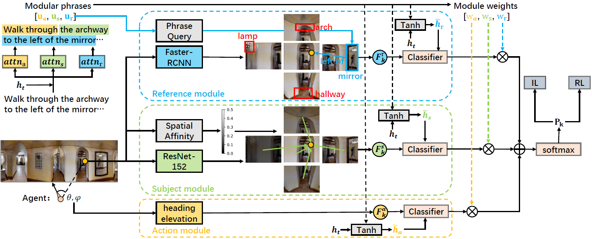
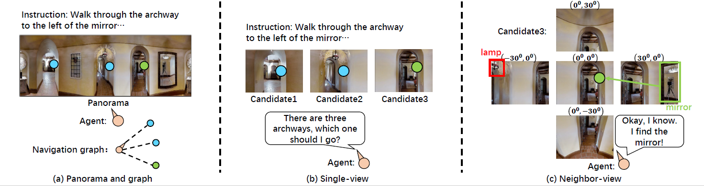

# NvEM

Code of the paper:
**Neighbor-view Enhanced Model for Vision and Language Navigation (ACM MM2021 **oral**)**<br>
[Dong An](https://marsaki.github.io/), [Yuankai Qi](https://sites.google.com/site/yuankiqi/home), [Yan Huang](https://scholar.google.com/citations?user=6nUJrQ0AAAAJ&hl=zh-CN), [Qi Wu](http://www.qi-wu.me/), [Liang Wang](https://scholar.google.com/citations?user=8kzzUboAAAAJ&hl=zh-CN), [Tieniu Tan](https://scholar.google.com/citations?hl=zh-CN&user=W-FGd_UAAAAJ)<br>

[[Paper](http://arxiv.org/abs/2107.07201)] [[GitHub](https://github.com/MarSaKi/NvEM)]

<p align="center">

</p>

## Motivation
<p align="center">

</p>
Most of existing works represent a navigable candidate by the
feature of the corresponding single view where the candidate lies
in. However, an instruction may mention landmarks out of the
single view as references, which might lead to failures of textual-visual matching of existing methods. In this work, we propose a
multi-module Neighbor-View Enhanced Model (NvEM) to adaptively
incorporate visual contexts from neighbor views for better textual-visual matching.

## Prerequisites

### Installation

Install the [Matterport3D Simulator](https://github.com/peteanderson80/Matterport3DSimulator). Please note that the code is based on **Simulator-v2**.

Please find the versions of packages in our environment in `requirements.txt`. In particular, we use:
- Python 3.6.9
- NumPy 1.19.1
- OpenCV 4.1.0.25
- PyTorch 0.4.0
- Torchvision 0.1.8

### Data Preparation

Please follow the instructions below to prepare the data in directories:

- `connectivity`
    - Download the [connectivity maps [23.8MB]](https://github.com/peteanderson80/Matterport3DSimulator/tree/master/connectivity).
- `data`
    - Download the [R2R data [5.8MB]](https://github.com/peteanderson80/Matterport3DSimulator/tree/master/tasks/R2R/data).
    - Download the vocabulary and the [augmented data from EnvDrop [79.5MB]](https://github.com/airsplay/R2R-EnvDrop/tree/master/tasks/R2R/data).
- `img_features`
    - Download the [Scene features [4.2GB]](https://www.dropbox.com/s/85tpa6tc3enl5ud/ResNet-152-places365.zip?dl=1) (ResNet-152-Places365).
    - Download the pre-processed [Object features and vocabulary [1.3GB]](https://zenodo.org/record/4310441/files/objects.zip?download=1) ([Caffe Faster-RCNN](https://github.com/peteanderson80/bottom-up-attention)).
- `GT for CLS score`
    - Download the [id_paths.json [1.4MB]](https://github.com/YicongHong/Recurrent-VLN-BERT/tree/main/data), put it in `tasks/R2R/data/`

### Trained Network Weights

- `snap`
    - Download the trained [network weights [116.0MB]](https://drive.google.com/drive/folders/1fICKJjG6iu3EJ7oEqwWO_mboDQukTcfd?usp=sharing)

## R2R Navigation

Please read Peter Anderson's VLN paper for the [R2R Navigation task](https://arxiv.org/abs/1711.07280).

Our code is based on the code structure of [EnvDrop](https://github.com/airsplay/R2R-EnvDrop) and [Recurrent VLN-Bert](https://github.com/YicongHong/Recurrent-VLN-BERT).

### Reproduce Testing Results

To replicate the performance reported in our paper, load the trained network weights and run validation:
```bash
bash run/valid.bash 0
```
Here is the full log:
```
Loaded the listener model at iter 119600 from snap/NvEM_bt/state_dict/best_val_unseen
Env name: val_seen, nav_error: 3.4389, oracle_error: 2.1848, steps: 5.5749, lengths: 11.2468, success_rate: 0.6866, oracle_rate: 0.7640, spl: 0.6456
Env name: val_unseen, nav_error: 4.2603, oracle_error: 2.8130, steps: 6.3585, lengths: 12.4147, success_rate: 0.6011, oracle_rate: 0.6790, spl: 0.5497
```

### Training

#### Navigator

To train the network from scratch, first train a Navigator on the R2R training split:
```bash
bash run/follower.bash 0
```
The trained Navigator will be saved under `snap/`.

#### Speaker

You also need to train a [Speaker](https://github.com/airsplay/R2R-EnvDrop) for augmented training:
```bash
bash run/speaker.bash 0
```
The trained Speaker will be saved under `snap/`.

#### Augmented Navigator

Finally, keep training the Navigator with the mixture of original data and [augmented data](http://www.cs.unc.edu/~airsplay/aug_paths.json):
```bash
bash run/follower_bt.bash 0
```

## Citation
If you use or discuss our Neighbor-view Enhanced Model, please cite our paper:
```
@misc{an2021neighborview,
      title={Neighbor-view Enhanced Model for Vision and Language Navigation}, 
      author={Dong An and Yuankai Qi and Yan Huang and Qi Wu and Liang Wang and Tieniu Tan},
      year={2021},
      eprint={2107.07201},
      archivePrefix={arXiv},
      primaryClass={cs.CV}
}
```
